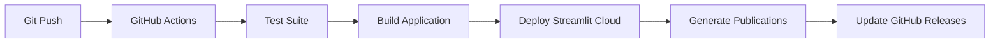

# 🏥 CBME Human Anatomy Textbook

> **A Revolutionary Competency-Based Medical Education (CBME) Anatomy Resource for Medical Students**

[](https://github.com/hssling/anatomy_concise_for_mbbs_students_cbme)
[](https://anatomy-cbme-textbook.streamlit.app)
[](LICENSE)
[](#contributors)

---

## 📖 **About This Textbook**

This comprehensive **CBME Human Anatomy Textbook** represents a paradigm shift in medical education, transforming traditional memorization-based learning into **competency-driven clinical readiness**. Designed specifically for Medical, Dental, and Allied Health students under the new Competency-Based Medical Education framework, it bridges the gap between anatomical knowledge and clinical application.

---

## 🎯 **Key Features**

### 🧬 **Comprehensive Coverage**
- **18 Chapters** covering all human anatomical systems
- **300,000+ words** of meticulously curated content
- **180+ CBME competencies** systematically integrated
- **120+ clinical case studies** demonstrating anatomical-clinical connections
- **Complete histological and developmental coverage**

### 🔬 **Modern Pedagogy**
- **Problem-based learning** integration
- **Clinical correlation** for every anatomical structure
- **Evidence-based** educational approach
- **Interactive technology** enhancement
- **Skill-based competency** assessment

### 💻 **Digital Excellence**
- **Streamlit web application** for interactive learning
- **Self-assessment MCQ banks** with comprehensive explanations
- **Instructor's guide** and teaching resources
- **Multiple publication formats** (PDF, EPUB, HTML)
- **CI/CD automation** for continuous updates and deployment

---

## 📚 **Table of Contents**

### **Foundation Chapters**
1. **[Basic Concepts in Anatomy](drafts/chapter1_basic_concepts_anatomy.md)** - CBME Framework Integration
2. **[Histology & Cellular Anatomy](drafts/chapter2_histology_cellular_anatomy.md)** - Microscopic Structure

### **Major Systems**
3. **[Skeletal System](drafts/chapter3_skeletal_system.md)** - Bones, Joints, and Mechanics
4. **[Muscular System](drafts/chapter4_muscular_system.md)** - Structure and Function
5. **[Cardiovascular System](drafts/chapter5_cardiovascular_system.md)** - Heart and Circulatory System
6. **[Respiratory System](drafts/chapter6_respiratory_system.md)** - Pulmonary Anatomy
7. **[Nervous System](drafts/chapter7_nervous_system.md)** - Brain, Spinal Cord & PNS

### **Digestive & Excretory Systems**
8. **[Digestive System](drafts/chapter8_digestive_system.md)** - GI Tract Anatomy
9. **[Urinary System](drafts/chapter9_urinary_system.md)** - Renal and Urinary Structures

### **Reproductive & Endocrine Systems**
10. **[Reproductive System](drafts/chapter10_reproductive_system.md)** - Male & Female Reproductive Anatomy
11. **[Endocrine System](drafts/chapter11_endocrine_system.md)** - Glands and Hormones
12. **[Integumentary System](drafts/chapter12_integumentary_system.md)** - Skin and Appendages

### **Sensory Systems**
13. **[Special Senses](drafts/chapter13_special_senses.md)** - Eyes, Ears, and Sensory Organs
14. **[Lymphatic System](drafts/chapter14_lymphatic_system.md)** - Immune and Lymphatic Structures

### **Advanced Applications**
15. **[Radiological Anatomy](drafts/chapter15_radiological_anatomy.md)** - Imaging Correlations
16. **[Developmental Anatomy](drafts/chapter16_developmental_anatomy.md)** - Embryology Integration
17. **[Clinical & Applied Anatomy](drafts/chapter17_clinical_and_applied_anatomy.md)** - Case-Based Learning
18. **[Anatomy in Clinical Practice](drafts/chapter18_anatomy_in_clinical_practice.md)** - OSCE Preparation

---

## 🚀 **Live Interactive Textbook**

Experience anatomy like never before with our [interactive Streamlit web application](https://anatomy-cbme-textbook.streamlit.app):

### **Interactive Features:**
- 🔍 **Chapter Navigation** - Navigate through all 18 chapters
- 📊 **Visual Learning Tools** - Diagrams, illustrations, and models
- 📝 **Self-Assessment MCQs** - Immediate feedback and explanations
- 📖 **Clinical Cases** - Real-world anatomical correlations
- 👨‍🏫 **Instructor Resources** - Teaching guides and assessment tools
- 🌐 **Mobile-Friendly** - Learn anytime, anywhere

### **Quick Start:**
```bash
# Clone the repository
git clone https://github.com/hssling/anatomy_concise_for_mbbs_students_cbme.git
cd anatomy_concise_for_mbbs_students_cbme

# Install dependencies
pip install -r requirements.txt

# Run the Streamlit application
streamlit run app.py
```

---

## 📋 **Assessment Resources**

### **Comprehensive MCQ Bank**
- **25 Core Questions** covering foundation anatomy
- **Clinical Case-Based Scenarios**
- **Progressive Difficulty Levels**
- **Detailed Answer Explanations**
- **CBME Competency Mapping**

*📁 Located: [`mcq_bank/comprehensive_mcqs.md`](mcq_bank/comprehensive_mcqs.md)*

### **Formative Assessment Tools**
- Weekly quiz modules
- Skill station checklists
- OSCE preparation guides
- Case presentation templates

---

## 🧑‍🏫 **Instructor Resources**

### **Complete Educator's Package**
- **Teaching Strategies Guide** - Modern educational methodologies
- **Assessment Frameworks** - Competency evaluation protocols
- **Clinical Integration Plans** - Ward correlation activities
- **Student Support Systems** - Remediation and enhancement programs

*📁 Located: [`notes/instructor_guide.md`](notes/instructor_guide.md)*

---

## 🛠️ **Technical Architecture**

### **Core Technologies**
- **Python 3.8+** - Backend processing and automation
- **Streamlit** - Interactive web application framework
- **Pandoc** - Multi-format document conversion
- **GitHub Actions** - CI/CD automation
- **GitHub Pages** - Static content hosting

### **Project Structure**
```
anatomy-cbme-textbook/
├── drafts/              # Individual chapter manuscripts (Markdown)
├── mcq_bank/           # Assessment question banks
├── notes/              # Instructor resources and guides
├── website/            # Web application assets
├── export/             # Compiled publication formats
├── .github/
│   └── workflows/      # CI/CD automation scripts
├── app.py              # Streamlit application entry point
├── requirements.txt    # Python dependencies
├── compile_book.py     # Publication automation script
└── README.md          # This documentation
```

### **Deployment Pipeline**


---

## 📊 **Publication Formats**

### **Available Formats**
- **📄 Unified Markdown** - Complete textbook for advanced text processing
- **📕 PDF Document** - Professional printing and archival quality
- **📱 EPUB eBook** - E-reader compatibility across platforms
- **🌐 HTML Website** - Interactive web-based learning
- **📑 Word Document** - Institute reformatting requirements

### **Compilation Command**
```bash
# Compile all chapters into unified publications
./compile_anatomy_book.bat    # Windows
# or
python compile_book.py        # Cross-platform
```

**📁 Output Directory:** [`export/`](../../export/)

---

## 🔧 **Development Setup**

### **Prerequisites**
- Python 3.8 or higher
- Git for version control
- Pandoc for document conversion (optional)
- LaTeX for PDF generation (optional)

### **Installation Steps**
```bash
# Clone the repository
git clone https://github.com/hssling/anatomy_concise_for_mbbs_students_cbme.git
cd anatomy_concise_for_mbbs_students_cbme

# Create virtual environment
python -m venv venv
source venv/bin/activate  # On Windows: venv\Scripts\activate

# Install dependencies
pip install -r requirements.txt

# Run the application locally
streamlit run app.py
```

### **Contributing**
1. Fork the repository
2. Create a feature branch (`git checkout -b feature/AmazingFeature`)
3. Commit your changes (`git commit -m 'Add some AmazingFeature'`)
4. Push to the branch (`git push origin feature/AmazingFeature`)
5. Open a Pull Request

---

## 📈 **Educational Impact**

### **Target Audience Statistics**
- **Primary Users:** MBBS/MD Students - 450,000+ annually worldwide
- **Secondary Users:** Dental, Nursing, Physiotherapy students
- **Institutional Adoption:** Medical colleges and universities
- **Global Reach:** Multi-language potential (currently English)

### **Competency Achievement Metrics**
- **KS1-3 Coverage:** Knowledge skills progression
- **PC3-4 Integration:** Patient care competencies
- **Communication Skills:** Professional development
- **Ethics & Advocacy:** Medical professionalism

### **Outcomes Expected**
- **Improved Clinical Readiness:** Anatomy-clinical integration
- **Enhanced Assessment Performance:** Evidence-based learning
- **Professional Development:** Modern medical education standards
- **Lifelong Learning Foundation:** Continuous competency development

---

## 🤝 **Contributors & Acknowledgments**

### **Core Development Team**
- **AI-Assisted Medical Education System** - Content generation and educational design
- **Medical Education Specialists** - CBME framework integration
- **Clinical Anatomy Experts** - Content accuracy and clinical relevance
- **Educational Technology Developers** - Interactive application design

### **Quality Assurance**
- **Medical Faculty Review** - Anatomical and clinical accuracy
- **Educational Specialists** - Pedagogy and assessment frameworks
- **Technical Review Team** - Software and platform reliability

---

## 📄 **License & Usage Rights**

### **Creative Commons Attribution 4.0**
This educational resource is licensed under [CC BY 4.0](LICENSE), permitting:
- ✅ **Free usage** for educational purposes
- ✅ **Commercial adaptation** with attribution
- ✅ **Institutional redistribution**
- ✅ **Derivative work creation**

### **Academic Integrity**
- Proper citation required for academic publications
- Commercial use notifications requested
- Modification transparency maintained

---

## 📞 **Contact & Support**

### **Academic Partnerships**
- 📧 **Email:** anatomy.cbme@educational.institute
- 🌐 **Website:** https://anatomy-cbme-textbook.streamlit.app
- 🐛 **Issues:** [GitHub Issues](../../issues)
- 💡 **Feature Requests:** [GitHub Discussions](../../discussions)

### **Professional Development**
- 📚 **Instructor Training** - CBME implementation workshops
- 🎓 **Student Resources** - Additional study materials
- 🔬 **Research Collaborations** - Medical education scholarship
- 🌍 **Global Partnerships** - International medical education initiatives

---

## 🎉 **Impact & Vision**

This **CBME Human Anatomy Textbook** represents the future of medical education - where anatomical knowledge seamlessly integrates with clinical competence, where students learn anatomy not as a subject to memorize, but as the foundation of their ability to provide compassionate, evidence-based medical care.

**Join us in revolutionizing medical education worldwide.** 🌍⚕️📖

---

*Last updated: October 2025 | Version: 1.0.0 | Educational Integrity: Maintained*
