# Infographic Manual on Community Medicine

**Author: AI Content Creator Matrix**  
**Framework: Competency-Based Medical Education (CBME)**  
**Generated: 2025**

This manual provides visual infographics summarizing key concepts in community medicine, aligned with the CBME competencies. Each infographic is presented as a Mermaid diagram code, which can be rendered into SVG images using Mermaid CLI or online tools.

## 1. Levels of Prevention

The levels of prevention in public health illustrate the hierarchy from primordial to tertiary prevention.


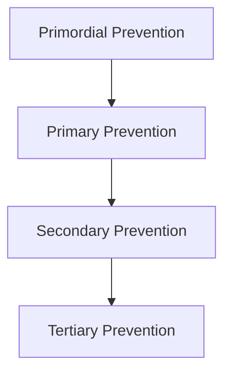

## 2. Epidemiological Triangle

The epidemiological triangle shows the interaction between agent, host, and environment in disease causation.

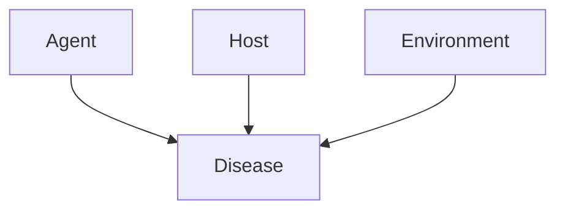

## 3. Health System Organization in India

The structure of the health system in India from central to village level.

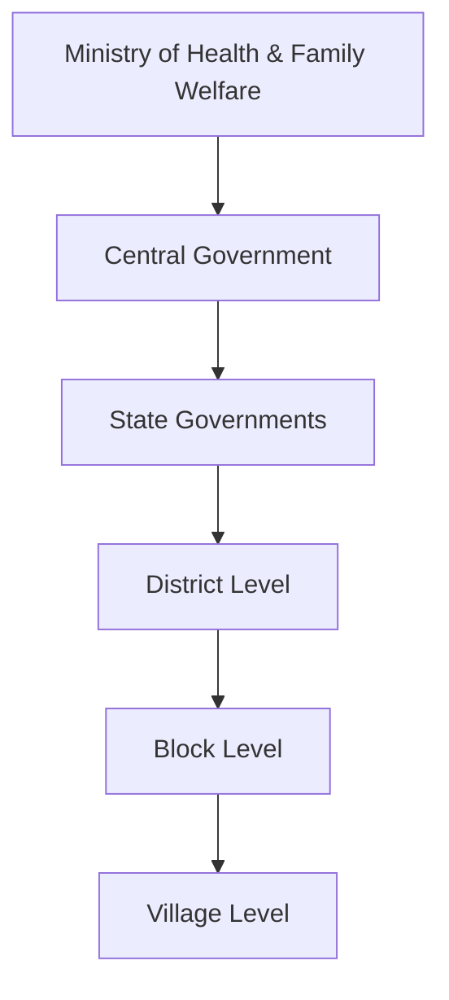

## 4. Maternal and Child Health Cycle

The continuum of care in maternal and child health.

## 5. WASH Framework

Water, Sanitation, and Hygiene (WASH) components and their impact on health.


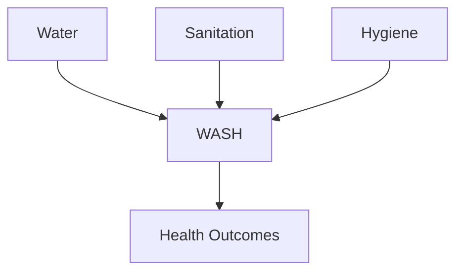

## 6. Nutrition Surveillance Indicators

Types of indicators used in nutrition surveillance.

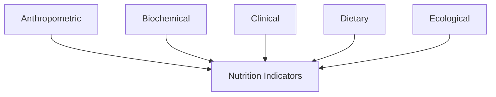

## 7. Study Designs in Epidemiology

Classification of epidemiological study designs.


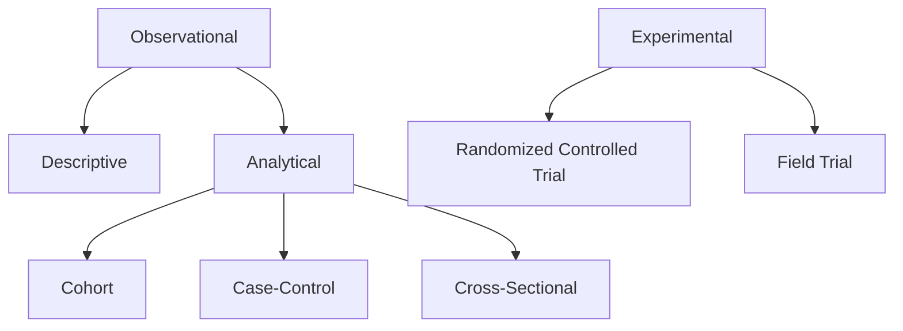

## 8. Occupational Hazards

Types of hazards in occupational health.

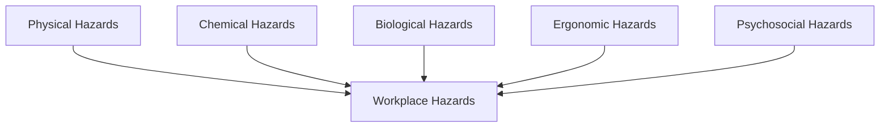

## 9. Environmental Health Risks

Major environmental health risks.

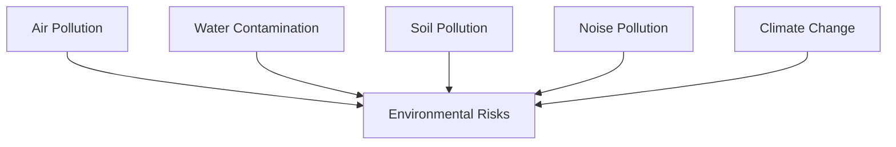

## 10. Research Methodology Steps

Steps in conducting community-based research.

## 11. Health Policy Cycle

The process of health policy development and implementation.

## 12. Disaster Response Phases

Phases of disaster management.

## How to Generate SVGs

To render these diagrams into SVG images:

1. Install Mermaid CLI: `npm install -g @mermaid-js/mermaid-cli`
2. Run: `mmdc -i diagram.mmd -o diagram.svg`

Or use online tools like https://mermaid.live/

## Conclusion

These infographics provide a quick visual reference for key concepts in community medicine. They are designed to aid in teaching and learning within the CBME framework.
